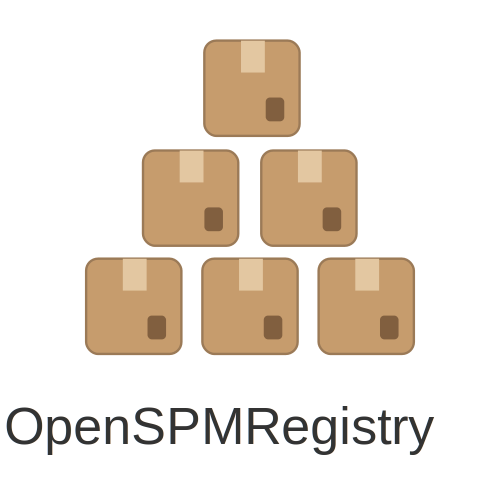

[](https://hub.docker.com/r/wgr1984/openspmregistry)


<table>
  <tr>
    <td style="border: none; outline: none">
      
    </td>
    <td style="border: none; outline: none">
      <pre>
  ___                   ____  ____  __  __ ____            _     _              
 / _ \ _ __   ___ _ __ / ___||  _ \|  \/  |  _ \ ___  __ _(_)___| |_ _ __ _   _ 
| | | | '_ \ / _ \ '_ \\___ \| |_) | |\/| | |_) / _ \/ _` | / __| __| '__| | | |
| |_| | |_) |  __/ | | |___) |  __/| |  | |  _ <  __/ (_| | \__ \ |_| |  | |_| |
 \___/| .__/ \___|_| |_|____/|_|   |_|  |_|_| \_\___|\__, |_|___/\__|_|   \__, |
      |_|                                            |___/                |___/ 
      </pre>
    </td>
  </tr>
</table>
  
Simple (using as much go std. lib and as less external dependencies as possible) implementation of Swift Package Manager Registry according to
https://github.com/swiftlang/swift-package-manager/blob/main/Documentation/PackageRegistry/Registry.md


# How To Use
There is a complete documentation available at https://wgr1984.github.io/docs/openspmregistry

Quick links:
- [Getting Started](https://wgr1984.github.io/docs/openspmregistry/gettingstarted)
- [Documentation](https://wgr1984.github.io/docs/openspmregistry/documention)

# Features
Browsing, Publishing (including signing) and retrieving of swift packages
[More](https://wgr1984.github.io/docs/openspmregistry/#features)

## Use Docker

Pull the image
```shell
docker pull wgr1984/openspmregistry:latest
```
then we can run it
```shell
docker run -p 8080:8080  \
  -v ./files:/app/files \
  -i -t wgr1984/openspmregistry:latest
```
or with a custom config (check [config.local.yml](#modify-config-optional))
```shell
docker run -p 8080:8080 \
  -v ./files:/app/files \
  -v ./config.local.yml:/app/config.yml \
  -i -t wgr1984/openspmregistry:latest
```

## Use source
### Checkout
```
git clone https://github.com/wgr1984/openspmregistry.git
```
### Modify config (optional)
copy `config.yml` to `config.yml.local` and adjust to your needs
```yaml
# config.local.yml:
server:
  hostname: 127.0.0.1
  port: 8080
  certs:
    cert: server.crt
    key: server.key
  repo:
    type: file
    path: ./files/
  publish:
    maxSize: 204800
  auth:
    enabled: false
```
hit go run:
```
 go run main.go -tls=true -v
```

# 📋 Todos ❎
[Roadmap](https://wgr1984.github.io/docs/openspmregistry/#roadmap)

# License
[BSD-3-Clause Licence](LICENSE)

# Disclaimer
This project is in an early stage and used in production at your own risk.
This project is a common use project and not affiliated with Apple Inc. or the Swift project.